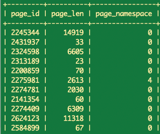
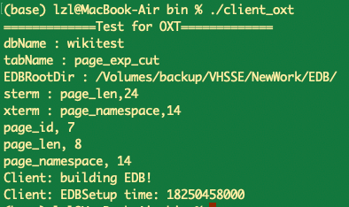
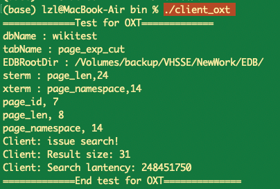

# OXT

This repository contains an cpp implementation of OXT(oblivious cross-tags) protol[1], which is a remarkable searchable encryption scheme with support for conjunctive queries and boolean queries.

## Requirements

* Git
* Ubuntu 18.04
* clang++15.0.0
* cmake 3.17
* openssl 1.1.1
* Apache Thrift 0.13.0
* Mysql  8.3.0

**please alter the CmakeList.txt according to your own include path and lib path of thrift and mysql.**

## Prepare

1. Before building and running, please set the following global env in include/utils/Config.h

```cpp
// config for you own mysql database
static const std::string dbName = "wikitest";
static const std::string tabName = "page_exp_cut";
static const char *host_ = "127.0.0.1";
static const char *user_ = "root";
static const char *pwd_ = "lzl_pass";
static const unsigned int port_ = 3306;

// the root dir of this project
static const std::string RootDir = "Root path of this project";
static const std::string EDBRootDir = RootDir + "EDB/";
static const std::string benchmarkPath = RootDir + "benchmark/";
```

2. migate the provided plaintext database into your mysql

In the OXT dir of this project, the file build_plaintext_database.sql is a script which can build a plaintext database of wikipedia statics information:



It has about 40000 records.

## Building

```bash
git clone https://github.com/jerry-luo-zl/OXT-cpp-implementation.git
cd OXT
mkdir build
cd build
# use cmake/make to build the code
cmake ..
make
```

## Usage

After compiling the project, two executable files of Aura will be generated in `OXT/bin`. The  two files (`client_oxt` and `server_oxt`)  can be used to execute OXT protocol in a networked environment.

### EDBSetup

At beginning, the EDB dir is empty, and we should build EDB(encrypted database) by client_oxt.

```bash
# in OXT/bin dir
./client_oxt
```

you should get:



and at this time, the EDB dir will be filled by the following files:

```bash
OXT_TSet.txt
OXT_XSet.txt
OXT_counter.txt
OXT_g.txt
d159.param
```

### Search

After EDBSetup, client issue a conjunctive query to the server and get the search results by:

```bash
# in OXT/bin dir
./server_oxt
./client_oxt 
```

and you will get:



## Feedback

- Email the authors: jerry001@sjtu.edu.cn

## Reference

[1] Cash, D., Jarecki, S., Jutla, C., Krawczyk, H., Roşu, M. C., & Steiner, M. (2013). Highly-scalable searchable symmetric encryption with support for boolean queries. In *Advances in Cryptology–CRYPTO 2013: 33rd Annual Cryptology Conference, Santa Barbara, CA, USA, August 18-22, 2013. Proceedings, Part I* (pp. 353-373). Springer Berlin Heidelberg.
